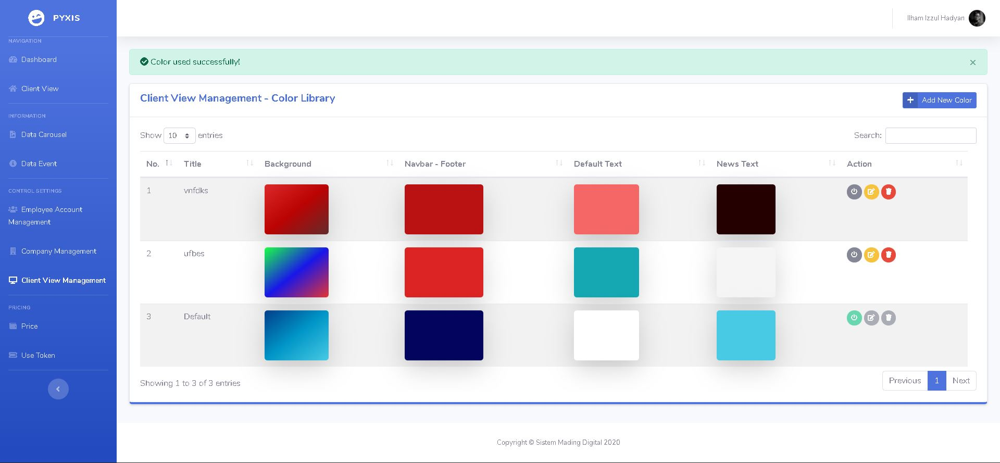
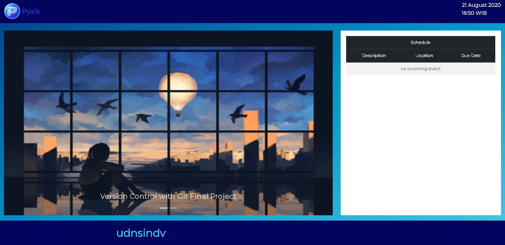

# Mading Digital

Mading Digital merupakan aplikasi berupa sistem informasi untuk menampilkan data dari schedule kantor, banner & video, serta informasi berupa running text. Mading Digital juga memiliki fitur untuk mengubah warna tampilan yang akan ditampil ke masyarakat.

## License

Please see the [license agreement](https://github.com/bcit-ci/CodeIgniter/blob/develop/user_guide_src/source/license.rst).
And also this project is licensed under the MIT License - see the [LICENSE.md](LICENSE.md) file for details

## Built With

* [Codeigniter 3](https://codeigniter.com/userguide3/general/welcome.html) - The web framework used
* [Bootstrap 4](https://getbootstrap.com/) - Front End Styling Framework
* [SB Admin 2](https://startbootstrap.com/themes/sb-admin-2/) - CMS Template we used

## Versioning

We use [SemVer](http://semver.org/) for versioning. For the versions available, see the [tags on this repository](https://github.com/ilhamizzul/mading_digital/tags). 

## Image Samples

## Author

* **Ilham Izzul Hadyan** - *fullstack*
